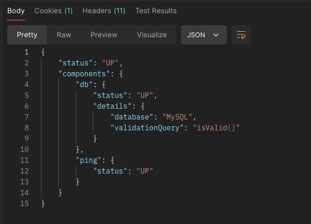

# SPRING PLUS

# EC2

---

# HealthCheck API
- Method : GET
- URI : /health
- URL : http://54.180.156.187:8080/health

# 대용량 데이터 처리

## 첫번째 조회 속도 

- 709 ms

## 두번째 조회 속도 (인덱싱을 활용한 조회)

- 71 ms

## 세번째 조회 속도 (인덱싱 + read only = true 옵션추가)

- 37 ms

